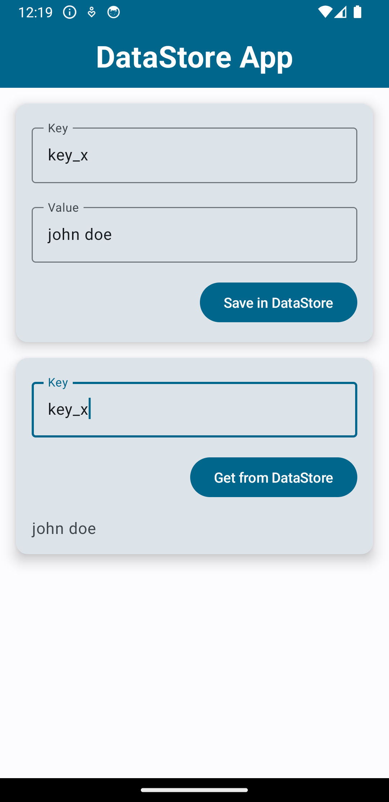

# DataStore_App

## Description

DataStore_App is an Android application showcasing the usage of the Android DataStore API. This project focuses on storing simple key-value pairs securely and efficiently using DataStore, a modern data storage solution recommended by Google for Android app development. 

Built with **Kotlin** and **Jetpack Compose**, DataStore_App serves as a practical example for developers looking to implement data persistence in their Android apps using the latest technologies.

## Screenshot

## Table of Contents

- [Installation](#installation)
- [Usage](#usage)
- [Contributing](#contributing)
- [License](#license)

## Installation

1. Clone the repository:
git clone https://github.com/rahulgothwal5/DataStore_App.git

2. Open the project in Android Studio.

## Usage

Explore the codebase to learn how to integrate and utilize the Android DataStore API in your Kotlin Android app.

## Contributing

1. Fork the repository.
2. Create a new branch (`git checkout -b feature/your-feature-name`).
3. Make your changes.
4. Commit your changes (`git commit -am 'Add new feature'`).
5. Push to the branch (`git push origin feature/your-feature-name`).
6. Create a new Pull Request.

## License

This project is licensed under the [MIT License](LICENSE).
